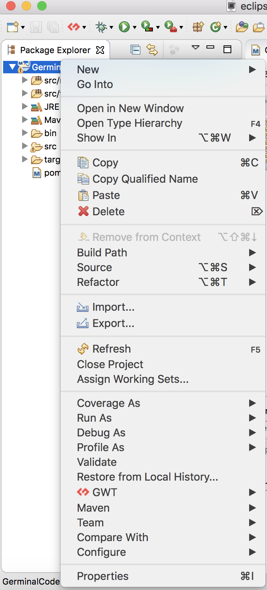
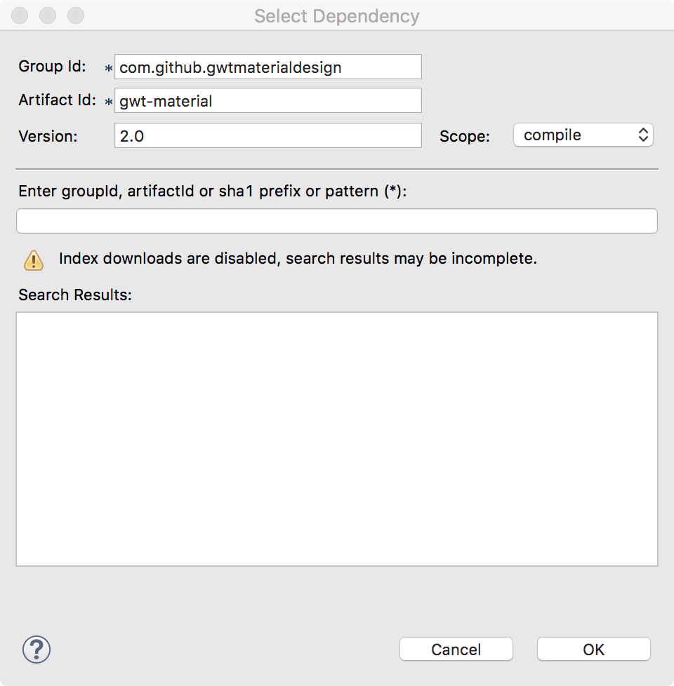

## Rebuilt GerminalCodebaseFramework From Scratch 

### Prerequisites

1. JDK 8 installed
2. Maven installed
3. Docker installed
4. Eclipse


Github repo: https://github.com/antenna3mt/GerminalCodebaseFramework

### Commit Init

1. Create a GWT maven project with the tutorial  http://www.gwtproject.org/usingeclipse.html
   Install GWT Eclipse Plugins and create a new project
   

2. Convert it to a maven project in Eclipse
  Right click project in Package Explorer -> Configure -> Convert to maven project
  

3. Run it in a development mode to make sure all successful

  Right-click project in Package Explorer -> Debug as -> GWT Development Mode with Jetty

### Commit gmd integrated

Tutorial for GWT Material Design: https://gwtmaterialdesign.github.io/gwt-material-demo/#gettingstarted

1. Add GMD 2.0 dependencies
   click pom.xml in Package Explorer -> dependencies tab -> add ->
   

2. Repeating step 1 to add total 5 dependencies

   ```xml
   <dependency>
     <groupId>com.github.gwtmaterialdesign</groupId>
     <artifactId>gwt-material</artifactId>
     <version>2.0</version>
   </dependency>

   <dependency>
     <groupId>com.github.gwtmaterialdesign</groupId>
     <artifactId>gwt-material-addins</artifactId>
     <version>2.0</version>
   </dependency>

   <dependency>
     <groupId>com.github.gwtmaterialdesign</groupId>
     <artifactId>gwt-material-themes</artifactId>
     <version>2.0</version>
   </dependency>

   <dependency>
     <groupId>com.github.gwtmaterialdesign</groupId>
     <artifactId>gwt-material-jquery</artifactId>
     <version>2.0</version>
   </dependency>

   <dependency>
     <groupId>com.github.gwtmaterialdesign</groupId>
     <artifactId>gwt-material-table</artifactId>
     <version>2.0</version>
   </dependency>
   ```

3. Config the GWT file `src/main/java/com/peruselab/GerminalCodebaseFramework.gwt.xml` and insert following lines to appropriate location

   ```xml
   <!-- Inherit GMD -->
   <inherits name="gwt.material.design.GwtMaterialWithJQuery" />

   <!-- Inherit GMD Jquery -->
   <inherits name="gwt.material.design.jquery.JQuery" />

   <!-- Inherit GMD Theme -->
   <inherits name="gwt.material.design.themes.ThemeAmberResources"/>

   <!-- Inherit GMD Addin -->
   <inherits name="gwt.material.design.addins.GwtMaterialAddins" />

   <!-- Inherit GMD Table -->
   <inherits name="gwt.material.design.GwtMaterialTable" />
   ```

4. Right click project in Package Explorer -> Debug as -> Maven install to install all dependencies

### Commit html template & gmd sample code

Code detali: [Commit](https://github.com/antenna3mt/GerminalCodebaseFramework/commit/7e5b6505cf7c9e2e5bd3675d6501be342506a7c0)

1. Revise the html file `src/main/webapp/GerminalCodebaseFramework.html` and css file `src/main/webapp/GerminalCodebaseFramework.css`
2. Revise the Java client `src/main/java/com/peruselab/client/GerminalCodebaseFramework.java`
3. Run it in a development mode to make sure all successful

### Commit parallax integrated

1. Download parallax-1.6.jar and move it to `lib/parallax-1.6.jar`
   https://github.com/thothbot/parallax/wiki/Download

2. Add a local jar in maven project

   ```xml
   <dependency>
     <groupId>thothbot</groupId>
     <artifactId>parallax</artifactId>
     <version>1.6</version>
     <scope>system</scope>
     <systemPath>${basedir}/lib/parallax-1.6.jar</systemPath>
   </dependency>
   ```

3. Revise `src/main/java/com/peruselab/GerminalCodebaseFramework.gwt.xml`

   ```xml
   <!-- Inherit Parallax -->
   <inherits name="thothbot.parallax.core.Core"/>
   ```

4. Right click project in Package Explorer -> Debug as -> Maven install to install all dependencies

### Commit parallax sample code

Parallax Docs: https://github.com/thothbot/parallax/wiki

Three.js Docs: https://threejs.org/

Code detail: [Commit](https://github.com/antenna3mt/GerminalCodebaseFramework/commit/3e911fc7a3597b2d7ab7b74b2d3740d333c4c622)

Implemented a 3D chemical bond drawing

Run it in development mode to make sure all works.

### Commit server talk

Implemented the communication function betwen client and server

Code detail: [Commit](https://github.com/antenna3mt/GerminalCodebaseFramework/commit/f6bdcdaf4f11e758c8cf87e146b134b5e7a69ed5)

Run it in development mode to make sure all works.

### Commit json lib

Add json dependency

Run maven install to install it.

### Commit elastic search demo

Implement a class communicate with elasticsearch server with pure Http URL request.

### Commit get url from env

Let the program get the elasticsearch server address from environment `GERMINAL_ELASTIC_ADDR`.

Set up the environment variavle In linux:

```shell
export GERMINAL_ELASTIC_ADDR = localhost:9200
```

Set up the environment variables in Eclipse:

Menubar -> Run -> Debug Configuration (Run Configuration) -> Environment -> Add

### Commit siderbar 

Add a siderbar on client.


